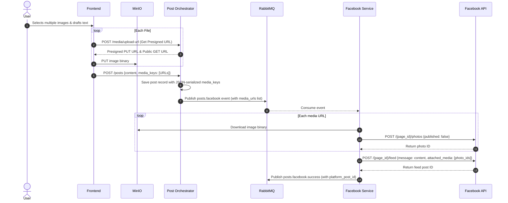
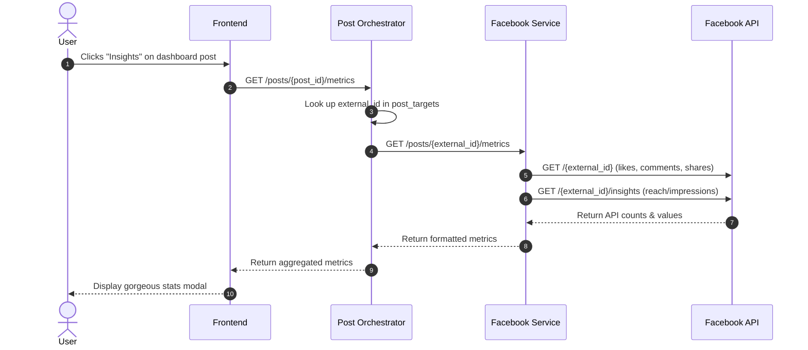

# Multi-Image Publishing & Real-time Insights Walkthrough

We have successfully implemented and verified the system-wide capabilities for:
1. **Publishing Multiple Images** to Facebook in a single post (via pre-signed multipart uploads to MinIO and Facebook's detached media attachment API).
2. **Exposing & Visualizing Real-time Insights** directly on the application dashboard.

---

## 1. Architecture Flow for Multi-Image Publishing

---

## 2. Real-Time Insights & Analytics Architecture

---

## 3. Implemented Components

### Backend
1. **Schema & Models**:
   - `media_keys` added to Pydantic serializers in `libs/common/serializers.py` and postgres schema in `services/post-orchestrator/db.py`.
   - Automatic migrations handles schema updates during orchestrator startup.
2. **RabbitMQ Event System**:
   - Updates `publish_post_event` in `services/post-orchestrator/events.py` to forward all internal MinIO public URLs under a list `media_urls`.
3. **Facebook Service**:
   - Added `post_multiple_photos` method inside `FacebookClient` which downloads binaries internally from MinIO, uploads them as unpublished media items, and binds them to a single feed post.
   - Added `get_post_metrics` logic supporting real-time likes, comments, shares, and unique impressions.

### Frontend
1. **Create Post View** (`frontend/src/app/post/page.tsx`):
   - Accepts multiple images via local selection.
   - Shows detailed upload progress for each image sequentially.
   - Passes all storage URLs under `media_keys` to the orchestrator.
2. **Dashboard Feed & Insights** (`frontend/src/app/dashboard/page.tsx`):
   - Displays image thumbnails on the activity feed.
   - Added an **Insights** action button.
   - Includes a beautifully crafted glassmorphism modal with KPI cards (Estimated Reach, Reactions, Comments, Shares) and per-platform breakdown sections.
